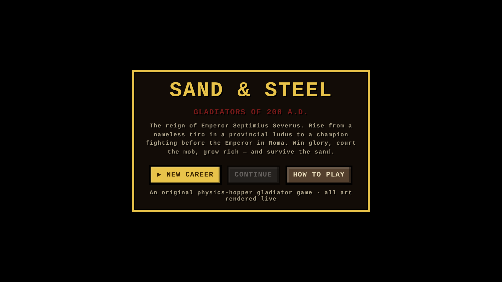
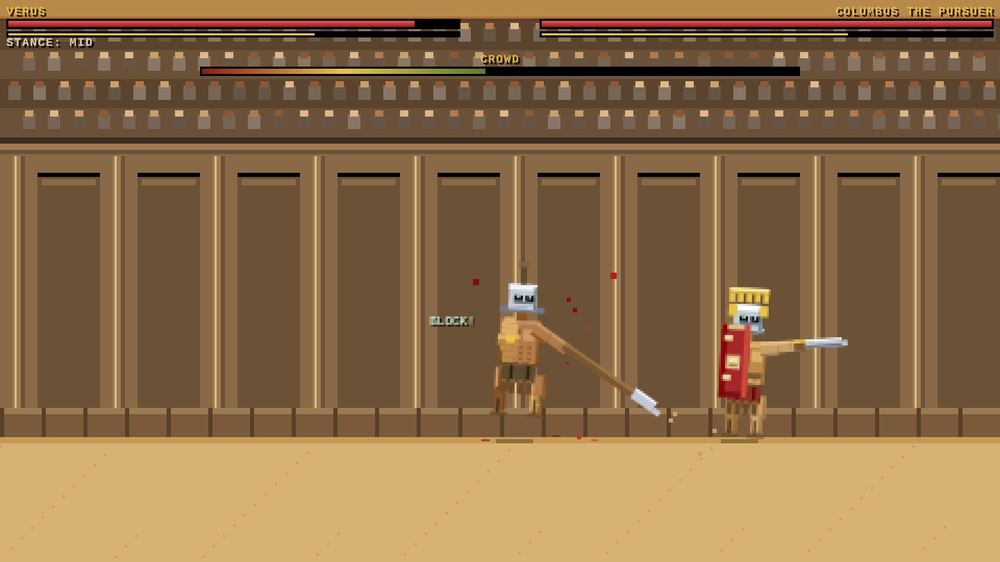
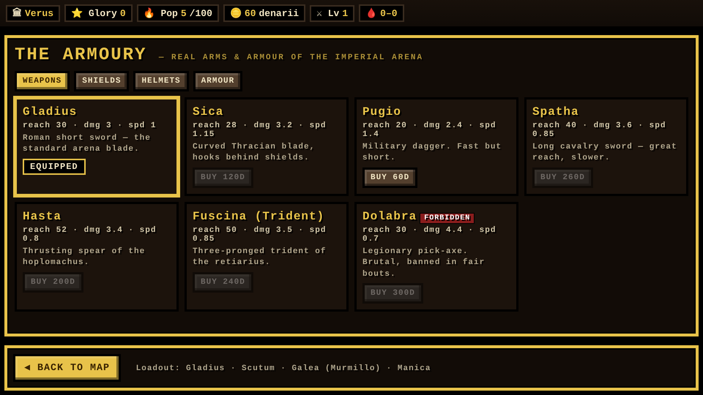
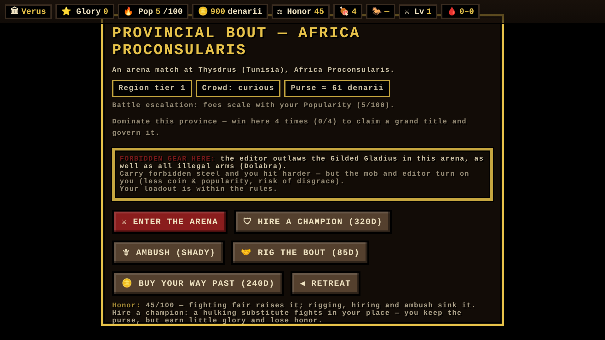
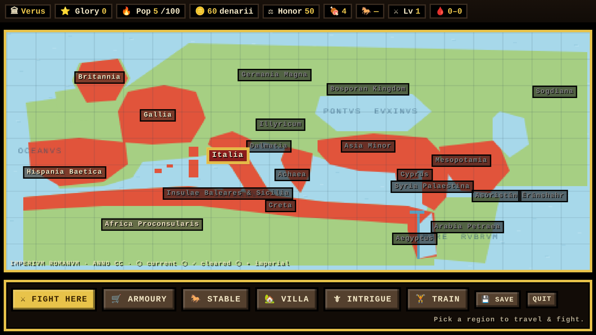
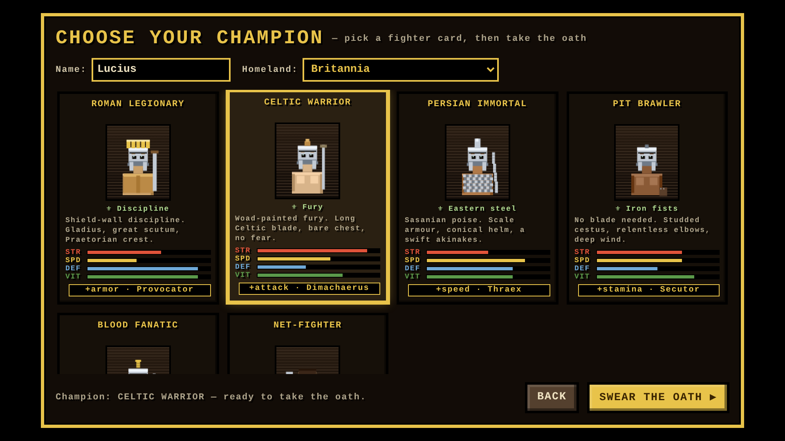
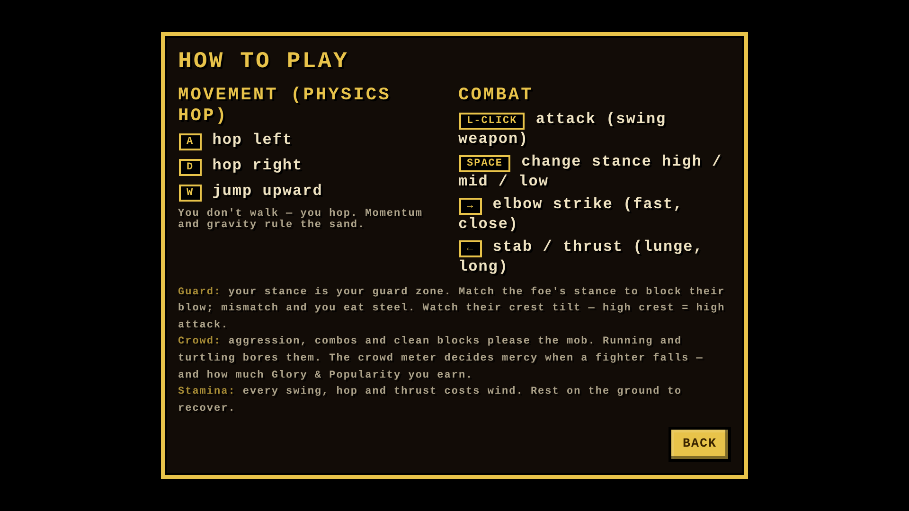
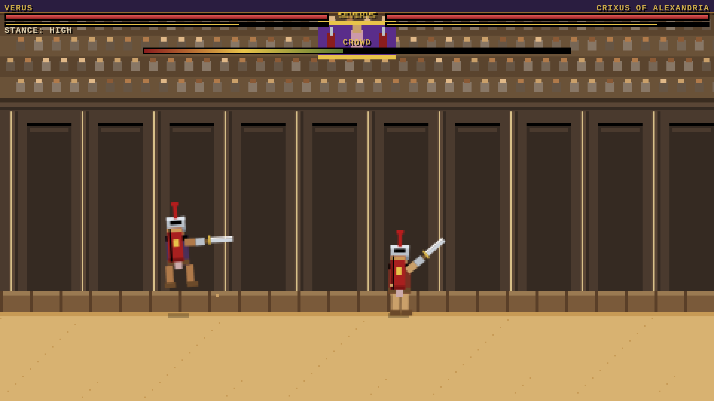

# SAND &amp; STEEL — Gladiators of 200 A.D.

An **original** 2D pixel-art, **physics-hopper** gladiator fighting game set in the
Roman world of **200 A.D.**, the reign of Emperor **Septimius Severus**.

Everything runs in a single self-contained `index.html` — no engine, no build step,
no external assets. **All pixel art (gladiators, the amphitheatre, the world map,
the Emperor's box) is drawn live on an HTML5 canvas.** Open the file and play.

All weapons, armour, gladiator classes, regions, cities and the Emperor are **real
historical content** from the period. No mythical content.

---

## ▶ Play it

| Option | Link / How |
| --- | --- |
| **▶ Instant play (no setup)** | **[Play now via htmlpreview](https://htmlpreview.github.io/?https://github.com/shuva18325/Ancient-Life-sim-300-A.D-/blob/claude/pixel-gladiator-game-ostlrm/index.html)** |
| **Download & double-click** | Download `index.html` from this repo and open it in any modern browser |
| **Permanent GitHub Pages link** | One-time setup: go to **Settings → Pages → Build and deployment → Source: GitHub Actions**, then re-run the *Deploy SAND & STEEL* workflow (or push again). The game publishes to `https://shuva18325.github.io/ancient-life-sim-300-a.d-/` |

> The htmlpreview link works immediately — no account, no setup. Click the game once
> to give it keyboard focus, then use the controls below.
>
> *(GitHub Pages can't be enabled automatically — the Actions token isn't allowed to flip
> that switch — so the one-time Source setting above is required for the permanent link.)*

---

## 1. Game overview

You begin as a nameless **tiro** (rookie) enrolled at a provincial *ludus* and claw
your way up to fight an **Imperial Spectacle in Roma before the Emperor himself**.

| System | What it does in the game |
| --- | --- |
| **Player progression** | Win bouts → earn XP → **level up** (more health, more damage). Train at the ludus for coin. |
| **Glory** | Your lifetime renown. Earned from wins, scaled by how hard the bout was and how the crowd loved you. Unlocks the imperial finale. |
| **Popularity** | The mob's love (0–100). High popularity **escalates** your career — bigger arenas, deadlier foes — and is the key that unlocks higher-tier regions. |
| **Wealth (denarii)** | Real Roman coin. Spend it in the armoury, on training, on rigging or skipping bouts. |
| **Crowd approval** | A live in-fight meter. Aggression, combos and clean blocks please the mob; running and turtling bore them. It decides **mercy when a fighter falls** and multiplies your Glory & Popularity rewards. |
| **Forbidden gear** | Each arena outlaws certain arms (and all inherently illegal arms like the *dolabra* or *lorica segmentata*). Carry forbidden steel → you **hit harder**, but the editor and mob turn on you: less coin, less popularity, risk of disgrace. |
| **Rigging battles** | **Bribe the editor** before a bout for a weakened foe — but you earn little Glory and risk whispers of corruption (a popularity hit if the crowd catches on). |
| **Skipping battles** | If you are **wealthy enough**, you can **buy your way past** a bout. It clears the region but the crowd brands you a coward (−popularity). |
| **Battle escalation** | Foes scale with your Popularity. As you rise the bouts grow from local arena matches → grand provincial spectacles → frontier death-matches → the Imperial Spectacle in Roma. |

**Escalation examples (in-game):**
- *“An arena match at Thysdrus (Tunisia), Africa Proconsularis.”*
- *“A grand provincial spectacle at Alexandria, Aegyptus.”*
- *“A grand spectacle at Caesarea (Judea), Syria Palaestina.”*
- *“IMPERIAL SPECTACLE in Roma — Emperor Septimius Severus watches from the pulvinar.”*

---

## 2. Controls (exactly as specified)

### Movement — physics-based hopping
| Key | Action |
| --- | --- |
| **A** | hop left |
| **D** | hop right |
| **W** | jump upward |

You do not walk — every step is a physics **hop** with real momentum, gravity and
landing wobble.

### Combat
| Input | Action |
| --- | --- |
| **Left-click** | attack (swing your weapon) |
| **Spacebar** | change stance — **high / mid / low** |
| **→ Right Arrow** | **elbow strike** (fast, very close range, crowd-pleaser) |
| **← Left Arrow** | **stab / thrust** (lunging, longest reach) |

*(Touch buttons appear automatically on mobile.)*

---

## 3. Combat system

- **Stance is your guard.** Your current stance (high/mid/low) is the zone you defend.
  Match the foe's stance to **block** their blow (shield reduces damage further); mismatch
  and you take a clean hit. Read the foe's helmet crest tilt — a high crest telegraphs a high attack.
- **Three attacks** with different reach/speed/damage: the weapon swing (left-click),
  the long lunging **thrust** (←), and the quick close **elbow** (→).
- **Stamina** drains with every hop, swing and thrust; stand still on the sand to recover.
- **Knockdown & verdict.** Drop a foe's health and the crowd renders a verdict
  (*Missus!* — spared in honour — or *Pollice verso*). A loved fighter is spared; a boring
  one is not. Your own falls are survivable but cost popularity.
- **Knockback is physical** — hits send fighters tumbling with ragdoll-ish wobble.

---

## 4. Gear &amp; upgrades (real historical arms only)

Buy and equip in **The Armoury**. All items are genuine Roman-era arena equipment.

**Weapons:** Gladius · Sica (curved Thracian blade) · Pugio (dagger) · Spatha (long
cavalry sword) · Hasta (thrusting spear) · Fuscina (trident) · *Dolabra* (legionary
pick — **forbidden**).

**Shields:** Parmula (buckler) · Scutum (great legionary shield) · Rete (casting net).

**Helmets:** Galea of the Thraex / Murmillo / Secutor / Hoplomachus / Provocator, or fight
bare-headed like a retiarius.

**Armour:** Galerus (shoulder-guard) · Manica (arm-guard) · Ocrea (greaves) ·
Cardiophylax (bronze breastplate) · *Lorica Segmentata* (**forbidden** full plate).

**Gladiator classes** (chosen at enrolment), each a real type with a starting kit and trait:
Murmillo, Thraex, Retiarius, Secutor, Hoplomachus, Dimachaerus, Provocator.

---

## 5. Economy system

- **Denarii** are earned from victories (purse scales with region tier and crowd approval)
  and spent on gear, training, **rigging** (bribe), and **skipping** (buy your way past).
- **Glory** and **Popularity** are separate currencies of fame that gate progression and the
  imperial finale.
- Risk/reward choices everywhere: a fixed bout is safe but cheap and shameful; forbidden gear
  hits hard but costs you the mob; buying past a fight saves your skin but your legend suffers.

---

## 6. Map system — the 21 regions (200 A.D.)

A stylised pixel map of the *Imperium Romanum* and its eastern frontier. Regions unlock as your
Popularity rises (battle escalation). **All 21 regions, exactly as specified:**

Gallia · Africa Proconsularis · Italia · Aegyptus · Syria Palaestina · Asia Minor · Achaea ·
Illyricum · Dalmatia · Bosporan Kingdom · Germania Magna · Hispania Baetica ·
Insulae Baleares &amp; Sicilia · Creta · Cyprus · Arabia Petraea · Asōristān · Mesopotamia ·
Ērānshahr · Sogdiana · Britannia

---

## 7. Screenshots (pixel art, captured from the live game)

| | |
| --- | --- |
|  |  |
|  |  |
|  |  |
|  |  |

---

## Historical notes

- **200 A.D.** falls in the reign of **Septimius Severus** (r. 193–211), who appears as the
  Emperor in the imperial finale.
- Arena cities are real: **Thysdrus** (El Djem, in modern Tunisia), **Alexandria**,
  **Caesarea** in Judaea, **Capua** (home of the most famous ludus), **Corduba**, **Ephesus**,
  **Petra**, **Ctesiphon** on the Sasanian frontier, and so on.
- Latin arena calls (*Missus!*, *Pollice verso*) and equipment names are used as they were.

This is an original work and does not reference, reuse, or depict any existing game.

---

## Tech

- Single file, vanilla JavaScript + Canvas 2D. ~1,000 lines, zero dependencies.
- Fixed-timestep-ish physics loop, nearest-neighbour scaling for crisp pixels.
- Progress auto-saves to `localStorage`.
- Screenshots were captured from the running game with Playwright/Chromium (`screenshots/`).
