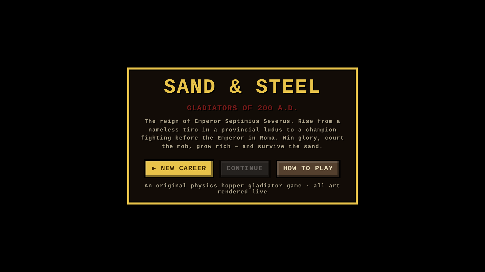
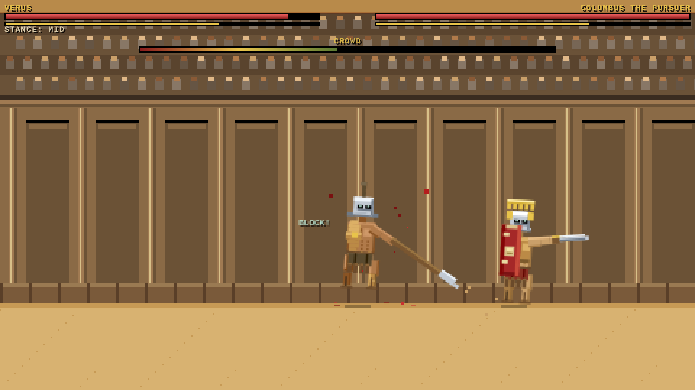
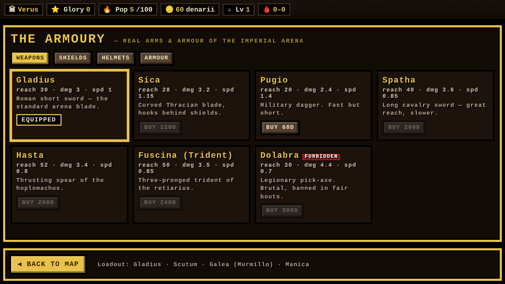
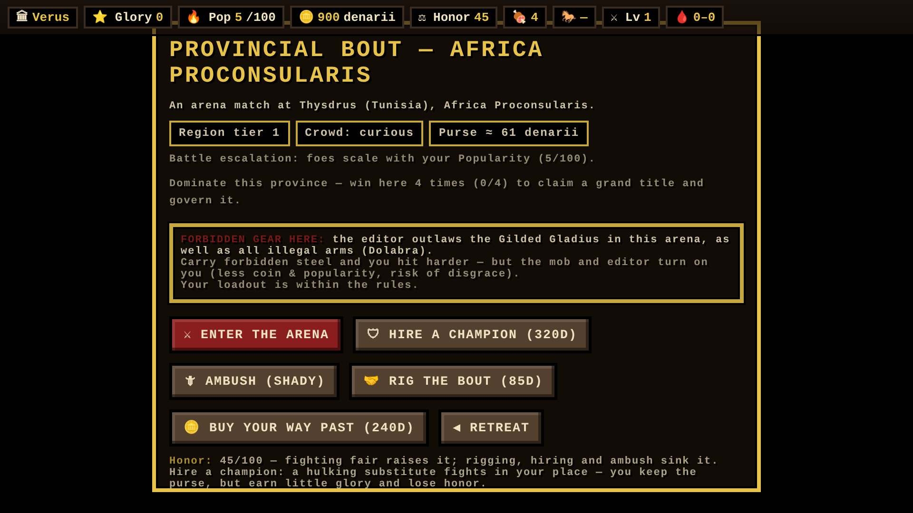
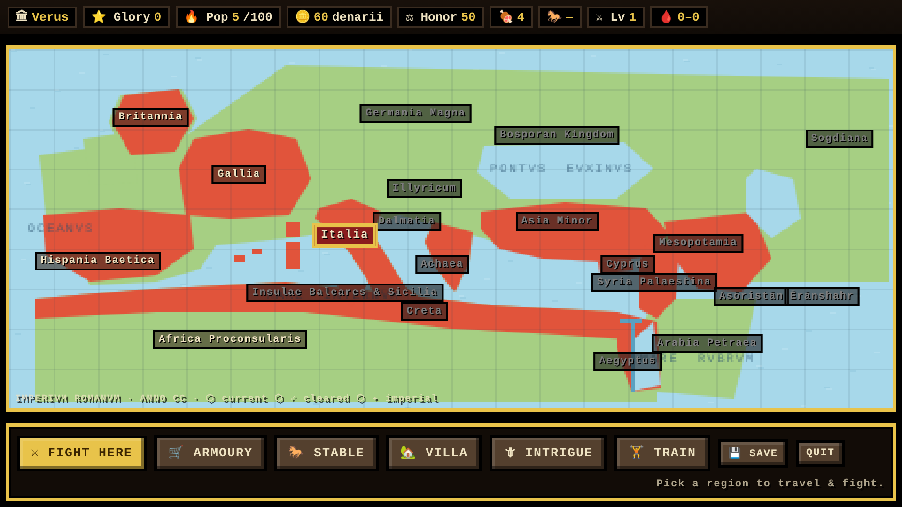
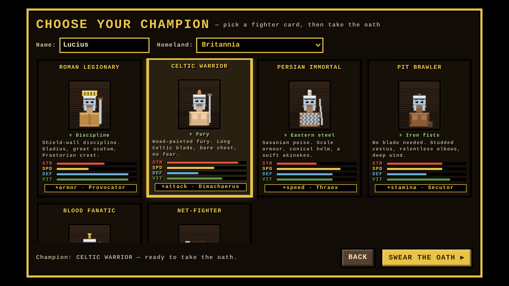
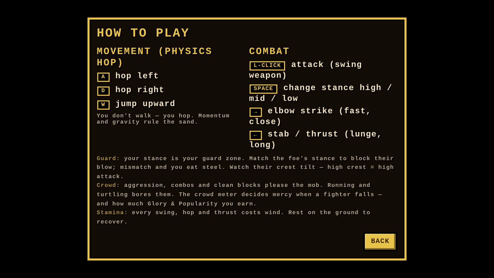
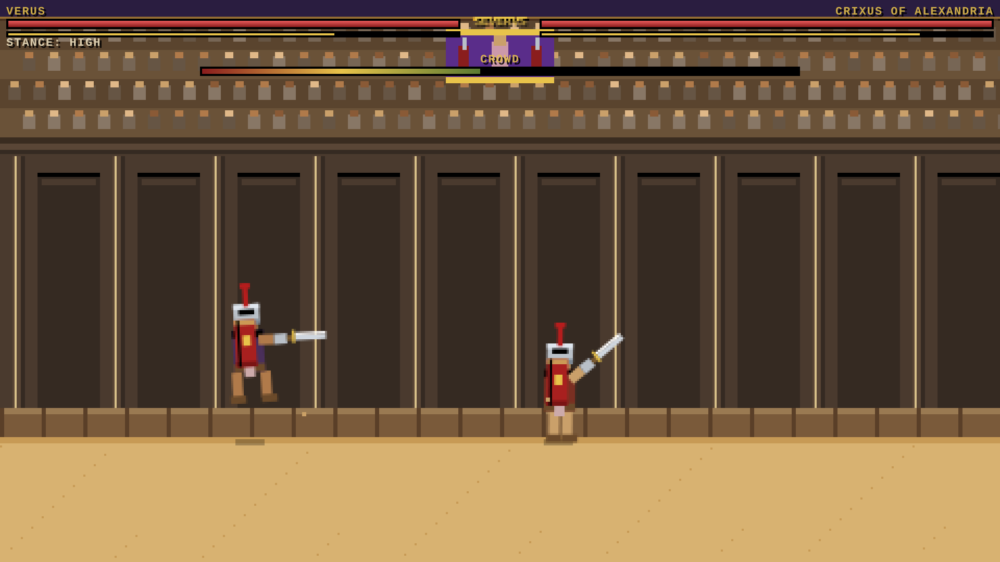

# SAND &amp; STEEL — Gladiators of 200 A.D.

An **original** 2D pixel-art, **physics-hopper** gladiator fighting game set in the
Roman world of **200 A.D.**, the reign of Emperor **Septimius Severus**.

Everything runs in a single self-contained `index.html` — no engine, no build step,
no external assets. **All pixel art (gladiators, the amphitheatre, the world map,
the Emperor's box) is drawn live on an HTML5 canvas.** Open the file and play.

All weapons, armour, gladiator classes, regions, cities and the Emperor are **real
historical content** from the period. No mythical content.

---

## ▶ Play it — in your browser, no setup

**Play now (public link, opens in any tab):**
**https://raw.githack.com/shuva18325/Ancient-Life-sim-300-A.D-/main/index.html**

That link serves this repo's `index.html` straight from a CDN, so it just runs — no
download, no server, no build step. Progress auto-saves to your browser.

Prefer offline? **Download `index.html` and double-click it** — it opens in any modern
browser with no internet connection at all.

Click the game once to give it keyboard focus, then use the controls below.

> A repository name note: the repo is called *Ancient-Life-sim-300-A.D-*, but the game
> itself is set in **200 A.D.**, the reign of **Septimius Severus** — that date is used
> consistently throughout.

---

## 🔞 Mature content — OFF by default

The game includes an **optional** adult bedchamber cutscene (with suggestive pixel art).
**It is turned OFF by default.** With it off:

- **Marriage, heirs, pregnancy and succession all play normally** — intimate moments simply
  **fade to black** and resolve with a discreet line. You lose no gameplay.
- No suggestive art, shadow-play, or explicit UI appears anywhere.

An adult can opt in with the **🔞 MATURE CONTENT** toggle on the title screen. The setting
is remembered on your device, separate from any save. If you plan to share or host this
publicly, leaving it off keeps the game safe for a general audience.

---

## Feature highlights
- **Fighter cards** — choose a champion (Roman Legionary, Celtic Warrior, Parthian Cataphract,
  Pit Brawler, Blood Fanatic, Net-Fighter), each a real gladiator class with a drawn portrait
  and stat bars. No default — you must pick.
- **Physics-hopper combat** — every step is a real hop with momentum and gravity; stance
  guards, thrusts, elbows, visible slash arcs, knockback and a live crowd meter. Hits land
  with **screen-shake, hit-stop, floating damage numbers** and a **combo meter** that climbs
  on a clean streak and breaks the moment you take a blow.
- **Venatio (beast hunt)** — take the **🐆 BEAST HUNT** at any arena and face a wild beast
  loosed on the sand, as the *venatores* did: a **Numidian leopard**, **Libyan lion**,
  **Caledonian bear** or **Hispanic bull**, each drawn live with its own stalking, pouncing
  AI. No fencing — only nerve, spear and blade. Rich glory if you kill it; a savaging if you
  don't. Wilder frontier provinces loose the bigger game.
- **Ranged weapons** — left-click throws instead of swinging, and your **stance is your aim**:
  a **head** strike is near-lethal (red), a **body** hit solid (yellow), a **leg** hit barely
  troubles a hardened man (green).
  - **Pilum** — buy up to 15 Roman javelins in the armoury (with a damage-by-zone chart).
  - **Bows** — pricier ranged weapons that **replace the javelin and never run dry**: the
    **Steppe Bow** looses fast, and the **Parthian Bow** (the composite bow that broke Crassus
    at Carrhae) is the deadliest draw in the East.
  - Priority is **bow → pilum → blade**: out of everything, left-click swings your weapon again.
- **A whole Roman life** beyond the arena: **travel** the 21-province map (mounts, rations,
  sea crossings), buy a **villa & farm**, take a **wife** and raise a **dynasty**, climb the
  **cursus honorum** by election, appoint **generals** and wage **army-vs-army war**, run
  **intrigue** against rival elites, and — at the summit — become **Emperor** and rule.
- **Succession** — when your gladiator's day is done, **play on as your son or daughter**,
  inheriting the family's standing.
- **Choose your sex, and roll for your blood** — pick ♂ or ♀ at the enrolment table (the champion
  cards are drawn for both), then **roll your own body and traits** as many times as you like. The
  ⛧ IMPOSSIBLE can land for anyone, but the odds climb steeply with rank: a gladiator's odds are a
  rounding error, a patrician's are real, and the **Emperor's Kin** roll it more often than not
  everyone else combined.
- **The wardrobe of rank** — an elite house or the imperial line starts with a **crown and an
  expensive robe already on them**, no purchase required (toggle it on or off from the villa).
  It is painted onto **every portrait of you and your house**. Everyone else sees exactly what it
  would take to earn one.
- **A family portrait gallery** — every name in your house gets a drawn face: parents, siblings,
  spouse, children and you. Rank is written on it (a patrician circlet, the imperial diadem, an
  Emperor's laurel), and the dead are painted with *D · M* the way every Roman tomb was.
- **The imperial court** — for those born to the purple: the **Praetorian Prefect** who really
  decides whether you keep breathing, three court figures with their own opinions of you, and a
  live **RISK TO THE PURPLE** reading fed by unrest, unanswered petitions and a brother with a
  better claim.
- **Every body is its own body** — the villa walk, the bride portraits and every intimate scene
  are drawn from the *actual* rolled scores of you and your spouse. A flat figure reads flat
  (no invented cleavage, no invented behind), a maxed one is unmistakable, and the shadow-play
  is measured rather than assumed.
- **The other ledger has a different seller for every class** — a poor man buys it from a stranger
  in a cloak because his dealings must stay hidden; everyone above him already has someone
  discreet in their own circle for it (a neighbour, a senator's wife, your own advocate, a lady of
  the palace) — and pays less for the convenience.
- **The house you were born into** — a father, a mother and siblings with real occupations and
  real opinions of you. A **prince** sees whether his sister has been married off yet; a
  **daughter of the purple** sees whether her brother is the heir — and whether *she* could
  take the throne instead (rare, but it happened: Irene of Athens signed herself *Basileus*).
- **Provincial management** — every title is a job. Set the **tax rate**, pay for a **garrison**
  and a **grain dole**, replace a governor who is stealing from you, hold **games** to buy back a
  province's temper, and answer the **petitions and complaints** that come up from the provinces:
  hear them out, refuse them, buy them off, make an example — or go and stand in front of them
  yourself, which works far better than it should if you are good-looking enough.
- **Looks are politics** — for a prince, a princess or an Augusta, a fine face is worth **public
  opinion**, **political tolerance** and **gifts that arrive unasked**.
- **Call-outs** — Rome says what it thinks of you, out loud, in the street. Satisfy the crowd,
  stoke your spouse's jealousy, balance it out — or, if your house is loyal enough, say nothing
  at all while your own people close on the man who spoke.
- **The body map, animated** — front, side, back and a walking figure for both sexes, with a
  **PUBLIC EYES** mode that counts where every eye in the colonnade actually went, and a
  **SPOUSE'S EYES** mode that shows only what the person you married looks at, ranked. Marriage
  doesn't close the chart — it adds a column: you can read it on **yourself and on your spouse**.
- **Honor & shady play** — fight fair to build public reputation, or *hire a champion*,
  *ambush* a foe, or *rig* a bout — each trades honour for an edge.
- All art is **drawn live on canvas** — no image assets ship with the game.

---

## 1. Game overview

You begin as a nameless **tiro** (rookie) enrolled at a provincial *ludus* and claw
your way up to fight an **Imperial Spectacle in Roma before the Emperor himself**.

| System | What it does in the game |
| --- | --- |
| **Player progression** | Win bouts → earn XP → **level up** (more health, more damage). Train at the ludus for coin. |
| **Glory** | Your lifetime renown. Earned from wins, scaled by how hard the bout was and how the crowd loved you. Unlocks the imperial finale. |
| **Popularity** | The mob's love (0–100). High popularity **escalates** your career — bigger arenas, deadlier foes — and is the key that unlocks higher-tier regions. |
| **Wealth (denarii)** | Real Roman coin. Spend it in the armoury, on training, on rigging or skipping bouts. |
| **Crowd approval** | A live in-fight meter. Aggression, combos and clean blocks please the mob; running and turtling bore them. It decides **mercy when a fighter falls** and multiplies your Glory & Popularity rewards. |
| **Forbidden gear** | Each arena outlaws certain arms (and all inherently illegal arms like the *dolabra* or *lorica segmentata*). Carry forbidden steel → you **hit harder**, but the editor and mob turn on you: less coin, less popularity, risk of disgrace. |
| **Rigging battles** | **Bribe the editor** before a bout for a weakened foe — but you earn little Glory and risk whispers of corruption (a popularity hit if the crowd catches on). |
| **Skipping battles** | If you are **wealthy enough**, you can **buy your way past** a bout. It clears the region but the crowd brands you a coward (−popularity). |
| **Battle escalation** | Foes scale with your Popularity. As you rise the bouts grow from local arena matches → grand provincial spectacles → frontier death-matches → the Imperial Spectacle in Roma. |

**Escalation examples (in-game):**
- *“An arena match at Thysdrus (Tunisia), Africa Proconsularis.”*
- *“A grand provincial spectacle at Alexandria, Aegyptus.”*
- *“A grand spectacle at Caesarea (Judea), Syria Palaestina.”*
- *“IMPERIAL SPECTACLE in Roma — Emperor Septimius Severus watches from the pulvinar.”*

---

## 2. Controls (exactly as specified)

### Movement — physics-based hopping
| Key | Action |
| --- | --- |
| **A** | hop left |
| **D** | hop right |
| **W** | jump upward |

You do not walk — every step is a physics **hop** with real momentum, gravity and
landing wobble.

### Combat
| Input | Action |
| --- | --- |
| **Left-click** | attack (swing your weapon) |
| **Spacebar** | change stance — **high / mid / low** |
| **→ Right Arrow** | **elbow strike** (fast, very close range, crowd-pleaser) |
| **← Left Arrow** | **stab / thrust** (lunging, longest reach) |

*(Touch buttons appear automatically on mobile.)*

---

## 3. Combat system

- **Stance is your guard.** Your current stance (high/mid/low) is the zone you defend.
  Match the foe's stance to **block** their blow (shield reduces damage further); mismatch
  and you take a clean hit. Read the foe's helmet crest tilt — a high crest telegraphs a high attack.
- **Three attacks** with different reach/speed/damage: the weapon swing (left-click),
  the long lunging **thrust** (←), and the quick close **elbow** (→).
- **Stamina** drains with every hop, swing and thrust; stand still on the sand to recover.
- **Knockdown & verdict.** Drop a foe's health and the crowd renders a verdict
  (*Missus!* — spared in honour — or *Pollice verso*). A loved fighter is spared; a boring
  one is not. Your own falls are survivable but cost popularity.
- **Knockback is physical** — hits send fighters tumbling with ragdoll-ish wobble.

---

## 4. Gear &amp; upgrades (real historical arms only)

Buy and equip in **The Armoury**. All items are genuine Roman-era arena equipment.

**Weapons:** Gladius · Sica (curved Thracian blade) · Pugio (dagger) · Spatha (long
cavalry sword) · Hasta (thrusting spear) · Fuscina (trident) · *Dolabra* (legionary
pick — **forbidden**).

**Shields:** Parmula (buckler) · Scutum (great legionary shield) · Rete (casting net).

**Helmets:** Galea of the Thraex / Murmillo / Secutor / Hoplomachus / Provocator, or fight
bare-headed like a retiarius.

**Armour:** Galerus (shoulder-guard) · Manica (arm-guard) · Ocrea (greaves) ·
Cardiophylax (bronze breastplate) · *Lorica Segmentata* (**forbidden** full plate).

**Gladiator classes** (chosen at enrolment), each a real type with a starting kit and trait:
Murmillo, Thraex, Retiarius, Secutor, Hoplomachus, Dimachaerus, Provocator.

---

## 5. Economy system

- **Denarii** are earned from victories (purse scales with region tier and crowd approval)
  and spent on gear, training, **rigging** (bribe), and **skipping** (buy your way past).
- **Glory** and **Popularity** are separate currencies of fame that gate progression and the
  imperial finale.
- Risk/reward choices everywhere: a fixed bout is safe but cheap and shameful; forbidden gear
  hits hard but costs you the mob; buying past a fight saves your skin but your legend suffers.

---

## 6. Map system — the 21 regions (200 A.D.)

A stylised pixel map of the *Imperium Romanum* and its eastern frontier. Regions unlock as your
Popularity rises (battle escalation). **All 21 regions, exactly as specified:**

Gallia · Africa Proconsularis · Italia · Aegyptus · Syria Palaestina · Asia Minor · Achaea ·
Illyricum · Dalmatia · Bosporan Kingdom · Germania Magna · Hispania Baetica ·
Insulae Baleares &amp; Sicilia · Creta · Cyprus · Arabia Petraea · Babylonia · Mesopotamia ·
Persis · Sogdiana · Britannia

---

## 7. Screenshots (pixel art, captured from the live game)

| | |
| --- | --- |
|  |  |
|  |  |
|  |  |
|  |  |

---

## Historical notes

- **200 A.D.** falls in the reign of **Septimius Severus** (r. 193–211), who appears as the
  Emperor in the imperial finale.
- Arena cities are real: **Thysdrus** (El Djem, in modern Tunisia), **Alexandria**,
  **Caesarea** in Judaea, **Capua** (home of the most famous ludus), **Corduba**, **Ephesus**,
  **Petra**, **Ctesiphon** on the Parthian frontier, and so on.
- Latin arena calls (*Missus!*, *Pollice verso*) and equipment names are used as they were.
- **The East is Parthian, not Sasanian.** In 200 A.D. Rome's great eastern rival was the
  **Parthian (Arsacid) Empire** — the Sasanians did not rise until Ardashir I (~224 A.D.).
  So the eastern regions (**Babylonia**, **Persis**), titles (*Satrap*, *Great King*, *King of
  Kings*), the frontier power, and the **Parthian Cataphract** fighter are all era-correct.

This is an original work and does not reference, reuse, or depict any existing game.

---

## Tech

- Single file, vanilla JavaScript + Canvas 2D. **~5,600 lines**, zero dependencies.
- Fixed-timestep-ish physics loop, nearest-neighbour scaling for crisp pixels.
- Progress auto-saves to `localStorage` (and warns you if the browser blocks storage).
- Optional adult content is gated behind a device-local flag, **off by default**.
- Screenshots were captured from the running game with Playwright/Chromium (`screenshots/`).
